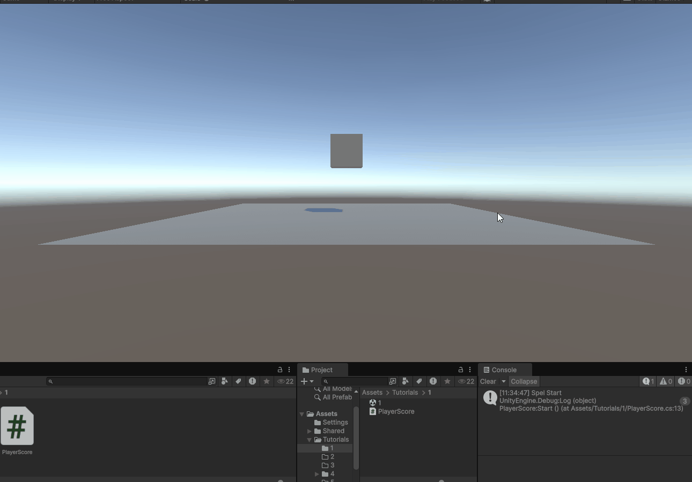
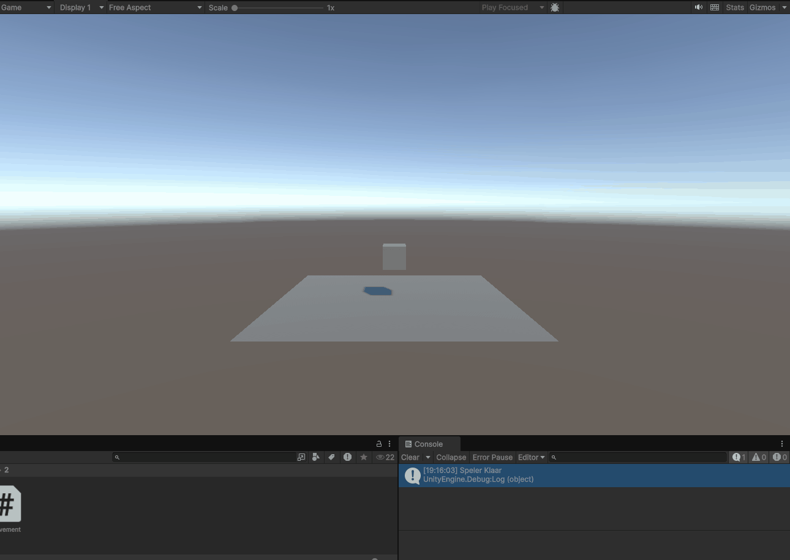
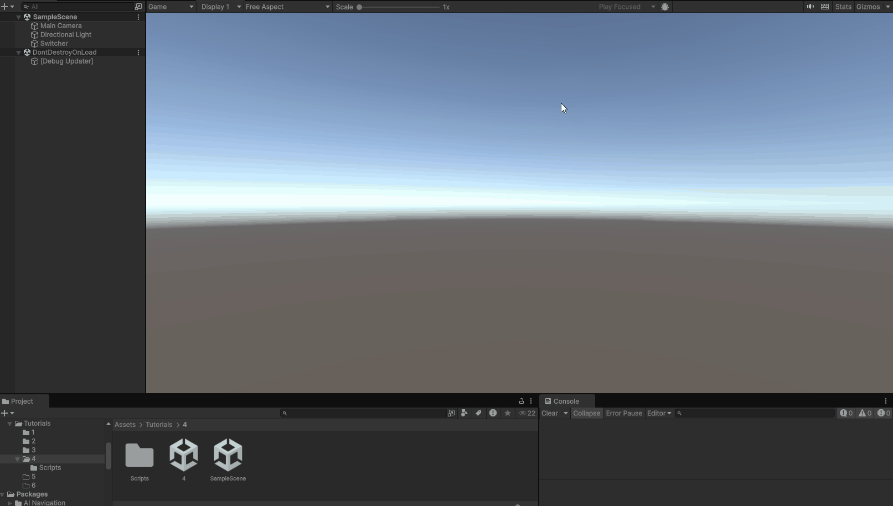
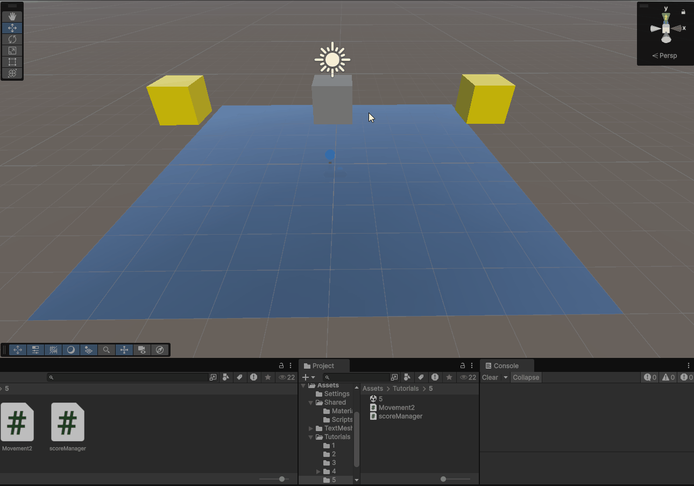

# Tutorial 1

als je space drukt, + 10 coins. bij 50 coins is er een win message

https://github.com/forestfox08/ProgM1-4/blob/main/Assets/Tutorials/1/PlayerScore.cs

# Tutorial 2

WASD + SPACE

https://github.com/forestfox08/ProgM1-4/blob/main/Assets/Shared/Scripts/Movement.cs

# Tutorial 4

in deze gif kan je zien dat ik een nieuwe scene in laad.

https://github.com/forestfox08/ProgM1-4/blob/main/Assets%2FTutorials%2F4%2FScripts%2FScreenswitch.cs

# Tutorial 5

in deze gif, opdracht 5...

https://github.com/forestfox08/ProgM1-4/tree/main/Assets/Tutorials/5

# Tutorial 6

- TBD
